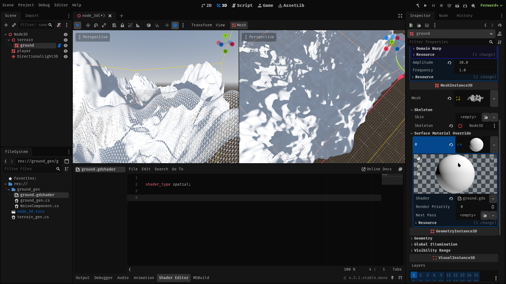
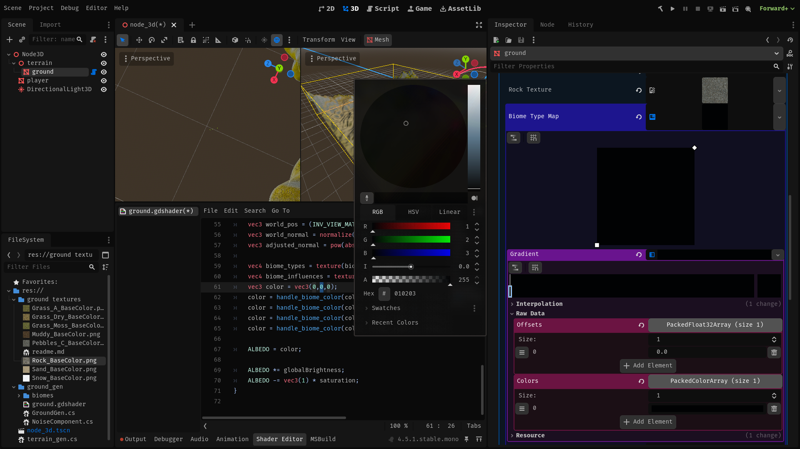
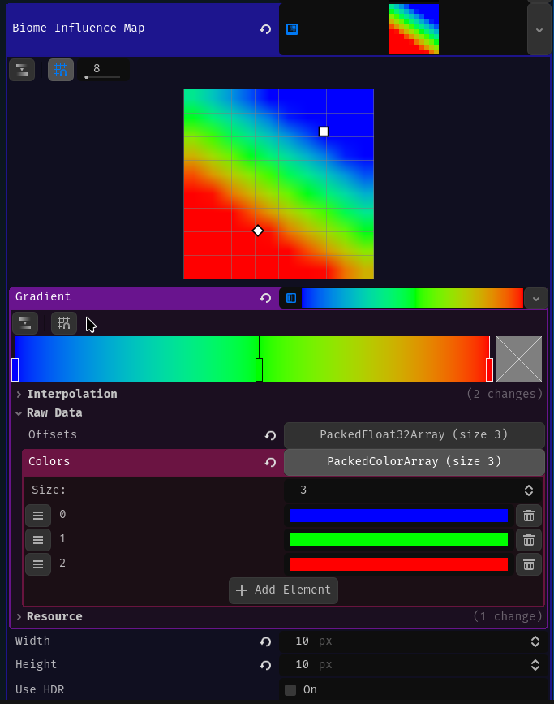

Right now our terrain looks boring, let's change it.
We will be utilizing shaders for this. 

So let's start by setting material on the ground mesh to be a shader material.
Now create a gdshader and drag it onto the shader material.



For test I will write a simple shader that will set all ground color to one that we can select by hand in the editor. 


## What a ground shader needs to have for an procedurally generated terrain? 

Ground in read world looks different in different places. In the high mountains there in only ice and snow, in Europe you mainly have beautiful grassy terrain and a lot of trees. 
We can achieve this diversity in a couple different ways:

#### Reading biome data from a texture
This is the most versatile approach, so I will be using it in this project.
It allows you to easily generate biomes with different structures and vegetation, by just once generating a pseudo random texture saying what kind of biome this is.
#### Generating biomes by reading the height of the current mesh
You can just read at what height the current mesh is, and than just say that at eg. 1000m this is a mountain - rocks / snow and at eg. 100 m this is a dessert.
This is not as versatile because 

## Writing the final shader 
Let's start by reading biome map from a texture. Biome data will be split into two textures, one for biome type data and another for influence of this texture, this will allow us to smoothly blend between, up to 4 textures. 
This will also allow for using up to 255 textures- enough for most games.

```gdshader
uniform sampler2D biome_type_map;
uniform sampler2D biome_influence_map;
void fragment(){
vec4 biome_types = texture(biome_type_map,UV);
vec4 biome_influences = texture(biome_influence_map,UV);
}
```

Next we will need to calculate world position and normals, this will be needed for Triplanar mapping - technique that will allow for smooth textures and drawing rock textures on slopes. 
Also I've added 'adjusted_normal' variable for normal map that will give better results for triplanar mapping.
```gdshader
void fragment(){
	vec3 world_pos = (INV_VIEW_MATRIX * vec4(VERTEX, 1.0)).xyz;
	vec3 world_normal = normalize((INV_VIEW_MATRIX * vec4(NORMAL, 0.0)).xyz);
	vec3 adjusted_normal = pow(abs(world_normal), vec3(8.0));
}
```


To implement triplanar mapping we will use data that we've callculated, and a rock texture.
We will read texture 3 times so with apropriate weights for each uv direction so that the texutres don't get streached in one of the orientation like in normal linear mapping.
Also we need to apply some scaling so that we can later modify scale of our textures. This is as easy as multiplying the uv vector.  
To Draw rock texture on the slopes we will replace the standard texture with the rock texture for the faces that don't face up - X and Z;

```gdshader
uniform float rock_saturation;
uniform float rock_scale;
uniform sampler2D rock_texture; 
vec3 triplanar (vec3 position, vec3 worldNormal,vec3 adjusted_normal, sampler2D sampler,float scale){
	vec3 weights = adjusted_normal / (adjusted_normal.x + adjusted_normal.y + adjusted_normal.z) * 3.0;
	
	vec2 uv_x = position.zy;
	vec2 uv_y = position.xz;
	vec2 uv_z = position.xy;
	
	vec3 color = vec3(0,0,0); 
	if (weights.x > 0.01){
		color += texture(rock_texture, uv_x * rock_scale).rgb * weights.x  * rock_saturation;
	}
	if (weights.y > 0.01){
		color += texture(sampler, uv_y * scale).rgb * weights.y;
	}	
	if (weights.z > 0.01){
		color += texture(rock_texture, uv_z * rock_scale).rgb * weights.z  * rock_saturation;
	}	
	
	return color / 3.0;
}
```

Now we need a function that will actually utilize this.
It will be adding calculated color to the input color.
We will be sampling texture of ground on a specified biome, using the Triplanar function, than applying some basic processing and adding it onto the input color with specified influence.    
``` gdshader

const int BIOMES_COUNT = 256;
uniform vec3[BIOMES_COUNT] texture_tint;
uniform float[BIOMES_COUNT] texture_saturation; 
uniform float[BIOMES_COUNT] texture_scale;
uniform sampler2D[BIOMES_COUNT] biome_textures;

vec3 handle_biome_color(vec3 input_color, float type_float, float influence, vec3 position, vec3 worldNormal, vec3 adjusted_normal){
	int type = int(type_float * 255.0);

	if (type == 0){
	return input_color;
	}

	int biome = type - 1;
	vec3 texture_color = triplanar(position, worldNormal, adjusted_normal, biome_textures[biome], texture_scale[biome]);
	vec3 biome_color = (texture_color + texture_tint[biome] - vec3(1) * texture_saturation[biome]) * influence;
	
	return input_color + biome_color;
}
```

now let's combine all of the things that we wrote. 
We will call the `handle_biome_color` function for each biome type and influence map segment, and collect their output.   
Then set the output color as albedo and apply some basic processing to get the final output.
``` gdshader

uniform float global_brightness;
uniform float global_saturation;
void fragment(){
	vec3 world_pos = (INV_VIEW_MATRIX * vec4(VERTEX, 1.0)).xyz;
	vec3 world_normal = normalize((INV_VIEW_MATRIX * vec4(NORMAL, 0.0)).xyz);
	vec3 adjusted_normal = pow(abs(world_normal), vec3(8.0));
	
	vec4 biome_types = texture(biome_type_map,UV);
	vec4 biome_influences = texture(biome_influence_map,UV);
	vec3 color = vec3(0,0,0);
	color = handle_biome_color(color, biome_types.r, biome_influences.r, world_pos, world_normal, adjusted_normal);
	color = handle_biome_color(color, biome_types.g, biome_influences.g, world_pos, world_normal, adjusted_normal);
	color = handle_biome_color(color, biome_types.b, biome_influences.b, world_pos, world_normal, adjusted_normal);
	color = handle_biome_color(color, biome_types.a, biome_influences.a, world_pos, world_normal, adjusted_normal);

	ALBEDO = color;

	ALBEDO *= global_brightness;
	ALBEDO -= vec3(1) * global_saturation;
}
```
And in the end we should have something like this:
```gdshader
shader_type spatial;
const int BIOMES_COUNT = 256;

uniform float global_brightness;
uniform float global_saturation;

uniform float rock_saturation;
uniform float rock_scale;
uniform sampler2D rock_texture; 

uniform sampler2D biome_type_map;
uniform sampler2D biome_influence_map;

uniform vec3[BIOMES_COUNT] texture_tint;
uniform float[BIOMES_COUNT] texture_saturation; 
uniform float[BIOMES_COUNT] texture_scale;
uniform sampler2D[BIOMES_COUNT] biome_textures;

vec3 triplanar (vec3 position, vec3 worldNormal,vec3 adjusted_normal, sampler2D sampler,float scale){
	vec3 weights = adjusted_normal / (adjusted_normal.x + adjusted_normal.y + adjusted_normal.z) * 3.0;
	
	vec2 uv_x = position.zy;
	vec2 uv_y = position.xz;
	vec2 uv_z = position.xy;
	
	vec3 color = vec3(0,0,0); 
	if (weights.x > 0.01){
		color += texture(rock_texture, uv_x * rock_scale).rgb * weights.x  * rock_saturation;
	}
	if (weights.y > 0.01){
		color += texture(sampler, uv_y * scale).rgb * weights.y;
	}	
	if (weights.z > 0.01){
		color += texture(rock_texture, uv_z * rock_scale).rgb * weights.z  * rock_saturation;
	}	
	
	return color / 3.0;
}

vec3 handle_biome_color(vec3 input_color, float type_float, float influence, vec3 position, vec3 worldNormal, vec3 adjusted_normal){
	int type = int(type_float * 255.0);

	if (type == 0){
	return input_color;
	}

	int biome = type - 1;
	vec3 texture_color = triplanar(position, worldNormal, adjusted_normal, biome_textures[biome], texture_scale[biome]);
	vec3 biome_color = (texture_color + texture_tint[biome] - vec3(1) * texture_saturation[biome]) * influence;
	
	return input_color + biome_color;
}

void fragment(){
	vec3 world_pos = (INV_VIEW_MATRIX * vec4(VERTEX, 1.0)).xyz;
	vec3 world_normal = normalize((INV_VIEW_MATRIX * vec4(NORMAL, 0.0)).xyz);
	vec3 adjusted_normal = pow(abs(world_normal), vec3(8.0));
	
	vec4 biome_types = texture(biome_type_map,UV);
	vec4 biome_influences = texture(biome_influence_map,UV);
	vec3 color = vec3(0,0,0);
	color = handle_biome_color(color, biome_types.r, biome_influences.r, world_pos, world_normal, adjusted_normal);
	color = handle_biome_color(color, biome_types.g, biome_influences.g, world_pos, world_normal, adjusted_normal);
	color = handle_biome_color(color, biome_types.b, biome_influences.b, world_pos, world_normal, adjusted_normal);
	color = handle_biome_color(color, biome_types.a, biome_influences.a, world_pos, world_normal, adjusted_normal);

	ALBEDO = color;

	ALBEDO *= global_brightness;
	ALBEDO -= vec3(1) * global_saturation;
}
```
## Testing this shader
We don't yet have a way to generate biome data textures, so we will need to improvise.
In the editor we will just use a simple gradient texture and set all colors to rgba(1,2,3,4) so that we can test using 4 different textures. 



We also need to set the influence of different biomes on our map, to do this we can just make a nice little graddient with each of the RGBA colors representing influence of one of the biomes. 




Next we need to set the textures - set 4 first texture slots in the Textures field and remember to set the rock texture.


The last thing we need to do is to set the global and biome texture specific: Saturation, tint and scale.
You need to chose them by experimentation, because different values will look good for different textures, but for me those values worked best:

Global brightness: 0.6
Global saturation: 0.0
Rock saturation: 0.5
Rock scale: 0.4

Tint: all textures to black - no tint
Texture saturation: 0.1 -> 0.3 
Texture scale: 0.2 -> 0.8 

Result:


